# Captain of Industry 工厂计算器使用说明

这是 [htpgc/captain-of-industry-calculator-zh-cn](https://github.com/htpgc/captain-of-industry-calculator-zh-cn) 的简体中文帮助文档。

本项目基于 [doubleaxe/daxfb-calculator](https://github.com/doubleaxe/daxfb-calculator) 二次开发，当前仅维护 Captain of Industry。

# 基本使用方式

计算器支持两种主要交互模式：`拖放模式` 与 `点击模式`。

- 拖放模式更适合 PC，默认在桌面设备上使用。
- 点击模式更适合移动设备，也可以在 PC 上使用。
- 可在“选项 / 设置”中切换相关交互方式。

如果两种模式同时启用，按住项目到真正开始拖动之间会有约 300 ms 延迟，用于区分单击与拖动操作。

## 拖放模式

在该模式下，主要操作都通过鼠标主键拖动完成。

拖动工厂并放到蓝图中

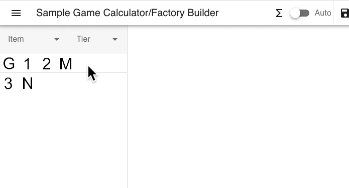

在工厂之间拖动建立连接

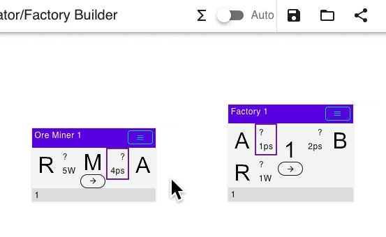

拖动连接调整端口顺序

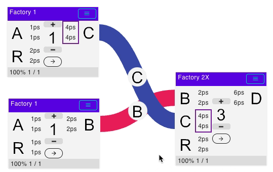

拖动工厂改变位置

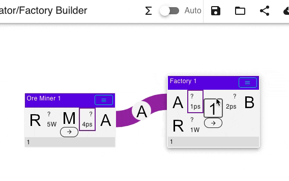

拖动空白区域平移画布

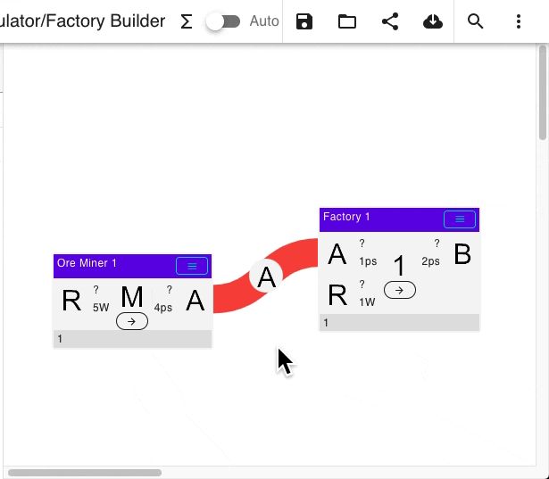

拖到窗口边缘时自动滚动画布

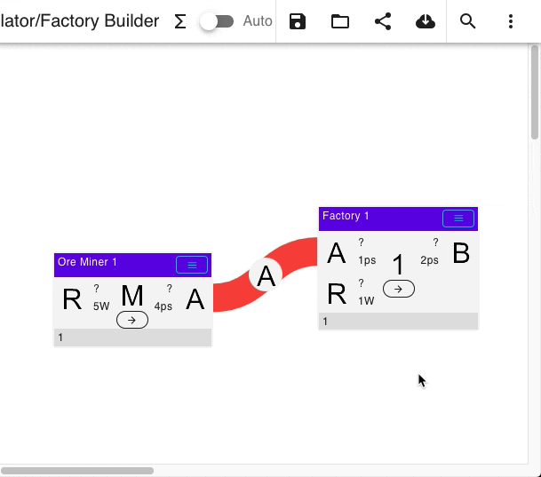

## 点击模式

在点击模式中，可先单击选中项目，再单击目标位置完成放置、连接或移动。

点击放置工厂

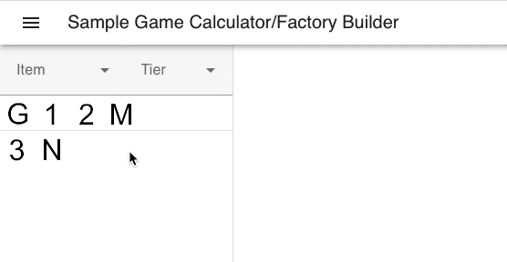

点击建立工厂连接

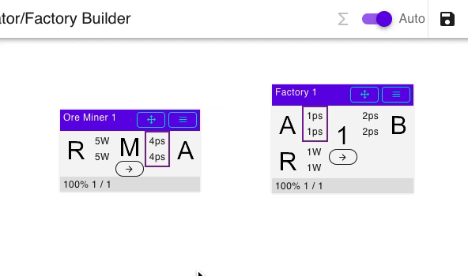

点击调整端口顺序

需要准确点击端口之间的空白区域。

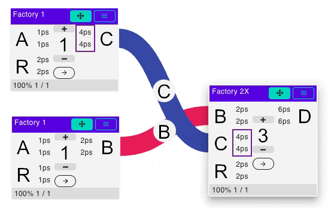

点击移动工厂

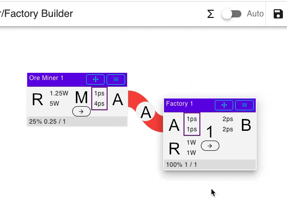

# 选择配方

单击工厂卡片中央的工厂图标即可选择配方，筛选功能同样适用于配方列表。

如果某个工厂只有一种配方，则不会弹出配方选择菜单。

示例

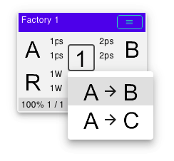

# 工厂旋转

工厂可以旋转，以便让连接线布局更整齐。

示例

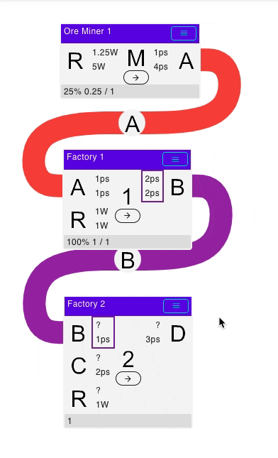

# 调整工厂数量

可通过工厂卡片上的菜单调整工厂数量。

设置中还可以启用工厂卡片正面的“+ / -”按钮：

- `+` 与 `-` 每次按 1 调整数值。
- 菜单中的输入框可填写小数数量。
- 工具栏中的“批量更新数量”可将自动计算得到的数量应用到蓝图中。

示例

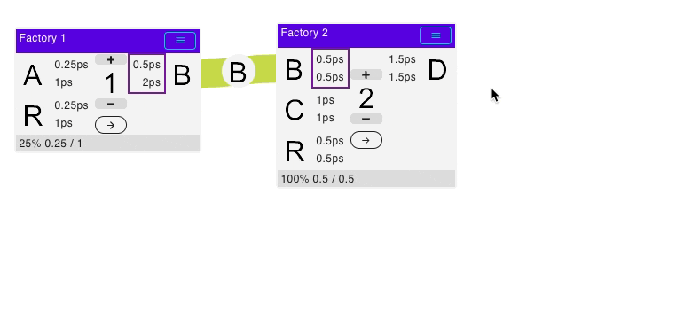

# 工厂升级 / 降级

如果某个工厂存在更高或更低等级版本，工厂菜单中会出现升级或降级选项。

开启升级模式后，会对蓝图中的相关工厂统一生效。

示例

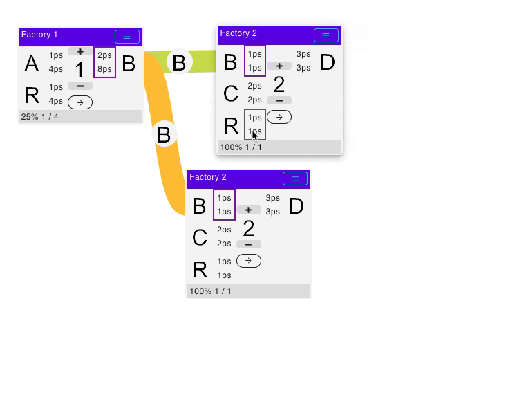

# 物流运输检查

对于已知运输方式的连接，例如传送带、管道等，可以查看物流运输信息。

单击连接菜单后会自动显示对应物流信息。某种运输方式也可以被锁定，锁定后整个蓝图会优先使用该运输方式。

示例

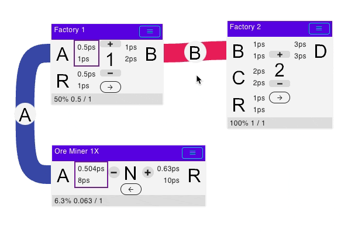

# 汇总窗口

汇总窗口用于显示整个蓝图的：

- 总消耗
- 总产出
- 建筑成本

汇总数据会随蓝图变化实时更新，因此对于非常大的蓝图，关闭汇总窗口可以减少计算开销。

汇总窗口支持简洁与展开两种显示方式，可通过对应按钮循环切换。

当蓝图为空或尚未完成计算时，汇总窗口不会显示有效数据。

生产 / 消耗统计主要显示蓝图中未与其他节点连接的开放端口。

示例

# 筛选

文本筛选支持输入多个关键词，关键词之间以空格分隔，并会同时参与匹配。

例如可以输入多个名称片段来快速定位目标工厂、物品或配方。

## 左侧面板筛选

左侧工厂列表可以按输入物品或输出物品筛选。

如果当前存在筛选条件，从左侧面板添加工厂到蓝图后，会自动优先选择匹配的配方。

## 按蓝图工厂的输入 / 输出筛选

工厂输入 / 输出附近显示吞吐量的方块可以点击，用于快速按照对应物品筛选左侧面板。

由于筛选后会自动选择匹配配方，因此这种操作适合快速搭建较长的生产链。

示例

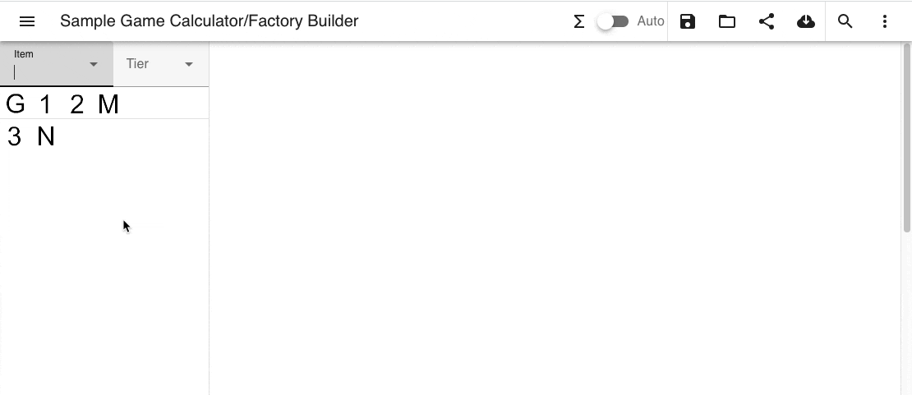

## 汇总窗口筛选

也可以单击汇总窗口中的物品图标应用筛选。

# 求解生产图

单击工具栏中的求解按钮即可计算生产图：

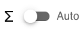

开启自动模式后，每次修改蓝图都会自动重新计算。

对于工厂数量很多的大型蓝图，建议使用手动模式，以减少频繁求解造成的性能开销。

求解使用固定精度，可在设置中修改。数值越小表示求解精度越高。

如果相连工厂之间的吞吐量差异非常大，或设置精度不足，可能产生数值误差。

## 自动检测生产图错误

当某个工厂同时输出多种产品，而这些产品直接或经生产链后又以不同速率进入同一后续工厂时，生产链可能出现不平衡。

生产循环也可能出现类似问题。此时求解器可能无法得到稳定流量，整个相关生产流量可能变为 0。

这与实际生产链中的堵塞或缺料情况类似。

求解器会尝试自动找出导致不平衡的输出端口。实现方式是在每个工厂输出端加入最低优先级的虚拟出口；如果该虚拟出口产生非零流量，则说明该输出存在未被消耗的溢出量，对应端口会以红色提示。

要解决该问题，需要增加实际建筑或消耗端来处理多余产物。

当前主要自动检测的是输出不平衡，因为这是最常见的情况。

示例

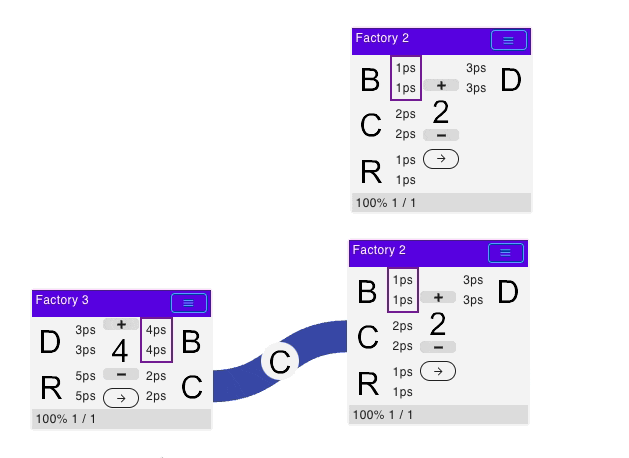

## 特殊建筑

游戏数据中可能包含一些用于辅助求解的特殊建筑。这类建筑通常表现为容器或虚拟节点，可接受某类物品，例如流体或固体。

它们通常提供输入、输出以及输入+输出等配方，可用于：

- 调整生产流量
- 处理开放端口
- 优化蓝图布局

# 微调求解过程

## 锁定工厂

默认情况下，如果一条生产线中没有锁定任何工厂，则工厂输入 / 输出不会超过其最大能力。

这种模式适合回答：

> 当前生产线的瓶颈在哪里，以及最终能够生产多少物品？

当锁定一个或多个工厂后，同一生产线中的其他工厂数量可以自动超过初始数量，以满足目标流量。

这种模式适合回答：

> 为达到指定产量，需要多少座工厂？

示例

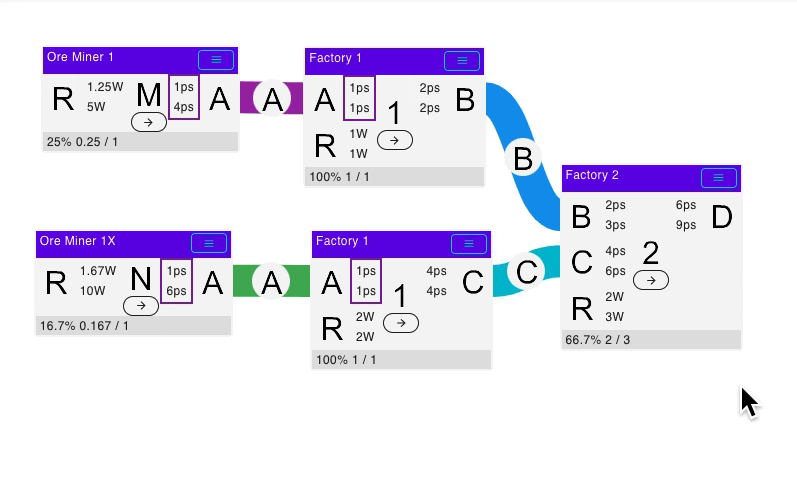

## 设置优化目标

默认情况下，求解器使用简单模式，尝试最大化整体输入 / 输出流量。

对于简单生产链通常足够，但在存在多个互相依赖的输出时，最大化某一种产物可能会压低另一种产物。

对于复杂生产链，建议只将一个最终产品设为主要目标。

求解器会先最大化主要目标，再在不影响主要目标的前提下优化次要目标。

如果某个工厂被设置为目标，其他未设置目标的工厂不会参与主要最大化过程。

示例

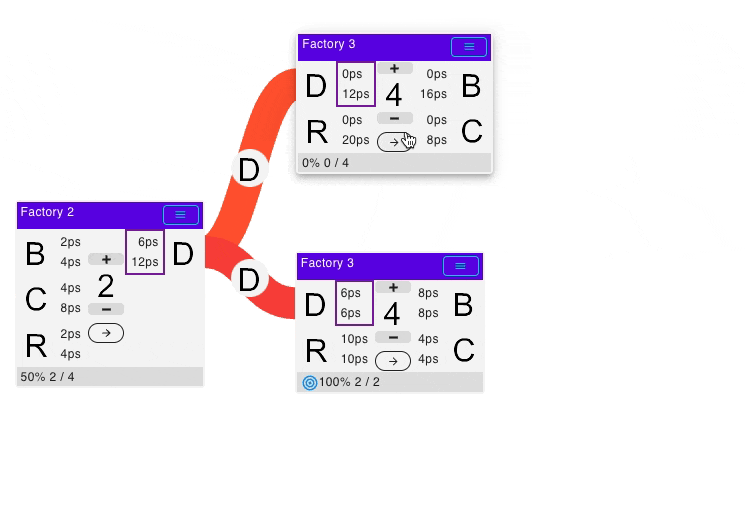

# 已知问题与限制

## 相连工厂之间的流量差异过大

当两个相连工厂的生产 / 消耗速率相差非常大，例如达到 1000 倍以上，同时工厂数量又不是整数时，可能由于数值精度不足而无法得到正确数量。

可以尝试在设置中使用更小的精度参数来提高计算精度，但在极端情况下仍可能无法完全消除误差。

# 项目链接

- 中文维护版：<https://github.com/htpgc/captain-of-industry-calculator-zh-cn>
- 上游项目：<https://github.com/doubleaxe/daxfb-calculator>
- Captain of Industry 数据导出工具：<https://github.com/doubleaxe/captain-of-data>
